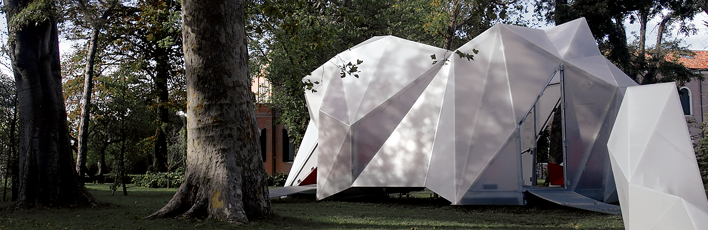

__ANDERS HOLDEN DELEURAN__\
Design Geometer + Coder | Full Stack AI Hater\
Senior Computational Design Specialist | [BIG](https://big.dk/)\
Perpetually Overdue PhD Fellow | [CITA](https://royaldanishacademy.com/en/CITA)

Contact:\
andersdeleuran[at]outlook.com

Connect:\
[`GitHub`](https://github.com/AndersDeleuran)\
[`Discourse`](https://discourse.mcneel.com/u/andersdeleuran/summary)\
[`Instagram`](https://www.instagram.com/andersholdendeleuran)\
[`LinkedIn`](https://www.linkedin.com/in/andersholdendeleuran)

Download:\
[`AECTech Course (2024)`](https://www.dropbox.com/scl/fi/r44su9z6tnutyyppkz9z9/240418_AECTech2024.pdf?rlkey=3dl5qx1jq3q2yel4sof4oi1ic&dl=0)\
[`GhPython Course (2021)`](https://www.dropbox.com/scl/fi/bjqkaemgevhrnz8u1x3sc/211103_Grasshopper103_CPH_Redacted.pdf?rlkey=udzmq3f3z010zegonyfviref9&dl=0)\
[`CV + Work Samples (2015)`](https://www.dropbox.com/scl/fi/pnl6ii8gmk86ikwnzz7i2/151112_AndersHoldenDeleuran_ShortCV_Worksamples.pdf?rlkey=ct5ofdkevmj4s0gr1n9z2ytlf&st=gt3646ja&dl=0)\
[`Portfolio (2013)`](https://www.dropbox.com/scl/fi/btv8spodbgmdp6r9lgc36/130527_ComplexModelling_AHD_Portfolio.pdf?rlkey=n03rj8s5gahua6v5wnsy4yxrv&st=tj6lnk55&dl=0)

Selected Work:\
[")](https://big.dk/projects/vasteras-travel-center-4170)
[")](https://big.dk/projects/vltava-philharmonic-prague-4340)
[")](https://big.dk/projects/athletics-las-vegas-ballpark-16435)
[")](https://big.dk/projects/3daysofdesign-materialism-21964)
[")](https://big.dk/projects/canninghill-piers-15842)
[")](https://big.dk/projects/ancient-future-bridging-bhutanese-tradition-and-innovation-21490)
[")](https://big.dk/projects/education-esbjerg-12538)
[")](https://big.dk/projects/dymak-hq-16408)
[")](https://www.instagram.com/p/CFb7q07g8TD/)
[")](https://big.dk/projects/denmarks-refugee-museum-4593)
[")](https://big.dk/projects/dansk-neuroforsknings-center-4121)
[")](https://big.dk/projects/oppo-rd-hq-hangzhou-3927)
[")](https://big.dk/projects/formgiving-exhibition-3740)
[")](https://www.instagram.com/p/BteJKl9hw6w/?utm_source=ig_web_copy_link&stkn=MzRlODBiNWFlZA==)
")
")
")
")
[")](https://royaldanishacademy.com/en/case/lace-wall)
[")](https://vimeo.com/162050529)
[")](https://royaldanishacademy.com/en/case/hybrid-tower)
[")](https://vimeo.com/125723745?fl=pl&fe=ti)
[")](https://riversidearchitecturalpress.ca/book/cita-complex-modelling/)
[")](https://www.aac-hamburg.com/publications/publicationscatalogue/270-research-lab-amphibious-hamburg/)
[")](https://vimeo.com/125721939?fl=pl&fe=vl)
[")](https://royaldanishacademy.com/en/case/dermoid-australia)
[")](https://www.dropbox.com/scl/fi/v2yuvk1ktu0wyjya0778m/TopologicalInfrastructureAnalysisSlideshow.pdf?rlkey=l8qn1v4gkv52ade4eo9upr38s&st=74y7tbi5&dl=0)
[")](https://royaldanishacademy.com/en/case/dermoid-copenhagen-design-week)
")
[")](https://royaldanishacademy.com/en/case/dermoid)
Work encoded using human brain neurons in `GhPython` `RhinoCommon` `Kangaroo2` `Rhino.Inside.Revit` `K2Engineering` `ShapeOp` `NetworkX` `MIConvexHull` `SpatialSlur` `MEL` `Nucleus`
<!--  -->

Publications:
1. [`Elephetus - Rethinking Patterns (2019)`](https://riversidearchitecturalpress.ca/book/cita-complex-modelling/)
1. [`Simulation in Complex Modelling (2017)`](https://www.dropbox.com/scl/fi/63o5p01i5snuehnhmsima/Thomsen-et-al._2017_Simulation-in-Complex-Modelling.pdf?rlkey=bm8s7ri81qnbbgp67bqroz1kq&st=k3bd8rt5&dl=0)
1. [`Lace Wall - Extending design intuition through Machine Learning (2017)`](https://www.dropbox.com/scl/fi/9f0nb786tsgjwf5mo4lnv/Tamke-et-al._2017_Lace-Wall-Extending-design-intuition-through-Machine-Learning.pdf?rlkey=y96j5hv2a96vxzavno9lt2rur&st=2di3q1d1&dl=0)
1. [`Calibrated and Interactive Modelling of Form-Active Hybrid Structures (2016)`](https://www.dropbox.com/scl/fi/uldnezzb3u0dkvnkvumjj/Quinn-et-al._2016_Calibrated-and-Interactive-Modelling-of-Form-Active-Hybrid-Structures.pdf?rlkey=bcnojc37slxuap7k1e3gisoba&st=qywglah7&dl=0)
1. [`Bespoke Materials For Bespoke Textile Architecture (2016)`](https://www.dropbox.com/scl/fi/7fsoky7xv900ofz977dxc/Tamke-et-al._2016_Bespoke-Materials-For-Bespoke-Textile-Architecture.pdf?rlkey=hlwddhkmsi9jmiocvr00xg35k&st=zfq8f9xj&dl=0)
1. [`Exploratory Topology Modelling of Form-active Hybrid Structures (2016)`](https://www.dropbox.com/scl/fi/twlgj5brnoeysuo46q85v/Deleuran-et-al._2016_Exploratory-Topology-Modelling-of-Form-active-Hybrid-Structures.pdf?rlkey=b7psfyou2uymngfyiva7oc2o8&st=fxlh42b5&dl=0)
1. [`Synthesizing a Nonlinear Modelling Pipeline for the Design of Masonry Arch Networks (2016)`](https://www.dropbox.com/scl/fi/kpbqytgxagks0ypft1avy/Foged_2017_Bricks-Systems.pdf?rlkey=k9glj70xv2q2sr07a1401956c&st=tbu9lfui&dl=0)
1. [`The Tower: Modelling, Analysis and Construction of Bending Active Tensile Membrane Hybrid Structures (2015)`](https://www.dropbox.com/scl/fi/u3pnavvl4vpvuv93zoqwl/Deleuran-et-al._2015_The-Tower-Modelling-Analysis-and-Construction-of-Bending-Active-Tensile-Membrane-Hybrid-Structures.pdf?rlkey=yrn3xi0jpxctxrdqqpw82vqez&st=haf0kbyc&dl=0)
1. [`Hybrid Tower - Designing Soft Structures (2015)`](https://www.dropbox.com/scl/fi/3p4vg5f3tg44cweb034bo/Thomsen-et-al._2015_Hybrid-Tower-Designing-Soft-Structures.pdf?rlkey=3hiij8ti4ubsw265xrl67rkhm&st=gje4fx87&dl=0)
1. [`ShapeOp - A Robust and Extensible Geometric Modelling Paradigm (2015)`](https://www.dropbox.com/scl/fi/k6f1rf0wbjudnu8yywygm/Deuss-et-al._2015_ShapeOp-A-Robust-and-Extensible-Geometric-Modelling-Paradigm.pdf?rlkey=zsnqvtfwxxonyd4zbtupn2ing&st=j9l0zm0e&dl=0)
1. [`Designing CNC Knit for Hybrid Membrane and Bending Active Structures (2015)`](https://www.dropbox.com/scl/fi/4ibwgbiggxdzstmn4vyoi/Tamke-et-al._2015_Designing-CNC-Knit-for-Hybrid-Membrane-and-Bending-Active-Structures.pdf?rlkey=0jwsclbjpvq2fzo18jkli1j72&st=1dtqt0uu&dl=0)
1. [`Impact on Tools for Architects: A Conversation with David Rutten and Daniel Piker (2014)`](https://www.dropbox.com/scl/fi/sy0ypi9zj6rqd6882vlv3/Deleuran-Rutten-Piker_2014_Impact-on-Tools-for-Architects-A-Conversation-with-David-Rutten-and-Daniel-Piker_Print.pdf?rlkey=lmsspogwir793wcxr7ado5lgp&st=g593h9ev&dl=0)
1. [`Topological Infrastructure Analysis of the Built Environment (2013)`](https://www.dropbox.com/scl/fi/3wz95ao46jasb27ibeljz/Deleuran-Derix_2013_Topological-Infrastructure-Analysis-of-the-Built-Environment.pdf?rlkey=xngfmee8mb85my1yugfhhymoe&st=otqp7svv&dl=0)
1. [`Structural Analysis and Optimisation of a Computationally Designed Plywood Gridshell (2013)`](https://www.dropbox.com/scl/fi/3dza4kiqv04eropqawswv/Quinn-et-al._2013_Structural-Analysis-and-Optimisation-of-a-Computationally-Designed-Plywood-Gridshell.pdf?rlkey=xhv5wn5r7uk2ue2xph6hnvrek&st=cbhnry1m&dl=0)
1. [`A New Material Practice ‐ Integrating Design and Material Behavior (2012)`](https://www.dropbox.com/scl/fi/0b7gzh54yfwhbk30v2xxh/Tamke-et-al._2012_A-New-Material-Practice-Integrating-Design-and-Material-Behavior.pdf?rlkey=j3veoz6k6m58ieofm0q2xvn2k&st=cscg286f&dl=0)
1. [`Process Through Practice: Synthesizing a novel design and production ecology through Dermoid (2012)`](https://www.dropbox.com/scl/fi/cbb0h9ew0v54f81uac4h5/Burry-et-al._2012_Process-Through-Practice-Synthesizing-a-novel-design-and-production-ecology-through-Dermoid.pdf?rlkey=mxisuybx384z57174m8f96c8d&st=x76l7tu8&dl=0)
1. [`Designing with Deformation ‐ Sketching material and aggregate behaviour of actively deforming structures (2011)`](https://www.dropbox.com/scl/fi/n7lm6254y28srwynsecri/Deleuran-Tamke-Thomsen_2011_Designing-with-Deformation-Sketching-material-and-aggregate-behaviour-of-actively-deforming-structures.pdf?rlkey=c1wsmgcii3nlmi19kum3v5qdy&st=t7dhbyh2&dl=0)
